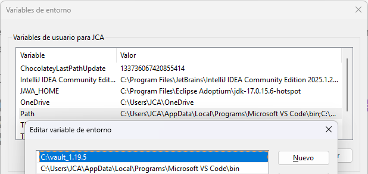
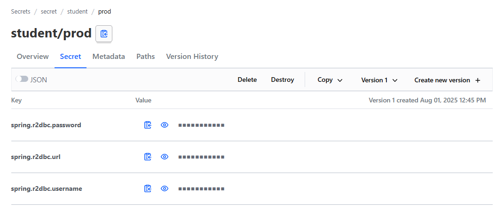

[](https://adoptium.net/es/temurin/releases/?os=windows&arch=any&package=jdk&version=17)

[](https://mvnrepository.com/artifact/org.springframework.boot/spring-boot-starter-web/3.2.5)

[](https://mvnrepository.com/artifact/com.mysql/mysql-connector-j/8.3.0)
[](https://mvnrepository.com/artifact/org.mapstruct/mapstruct/1.5.5.Final)

[](https://mvnrepository.com/artifact/org.projectlombok/lombok/1.18.32)


[](https://developer.hashicorp.com/vault/install)


# API STUDENT

Api creado para registro de estudiantes en MySQL, se ha desarrollado un CRUD completo utilizando Spring Boot WebFlux, R2DBC y MapStruct. La aplicación permite realizar operaciones de creación, lectura, actualización y eliminación de estudiantes de manera asíncrona.

## Instalación
1. Clonar el repositorio:
   ```bash
   git clone https://github.com/josephmn/student.git

2. Abrir el proyecto en tu IDE favorito (IntelliJ, Eclipse, etc.).
3. Configurar la base de datos MySQL:
    - Crear una base de datos llamada `demo`.
    - Ejecutar el siguiente script SQL para crear la tabla `student`:
      ```sql
      CREATE TABLE IF NOT EXISTS student (
         id INT AUTO_INCREMENT PRIMARY KEY,
         document VARCHAR(15),
         name VARCHAR(50),
         last_name VARCHAR(50),
         status BOOLEAN,
         age int
      );
      
      INSERT INTO student (document, name, last_name, status, age)
      VALUES
      ('11111111','Julian','Fernandez',1,25),
      ('22222222','Felipe','Vicente',0,35),
      ('33333333','Alexander','Gutierrez',1,26),
      ('44444444','Felix','Saravia',0,19),
      ('55555555','Alberto','Peña',1,32),
      ('66666666','Cristian','Dominguez',0,35),
      ('77777777','Ronaldo','Flores',1,40),
      ('88888888','Juan','Enrique',0,21);
      ```
4. Instalar Vault para el almacenamiento de secretos:
    - Descargar e instalar Vault para su SO, desde [Vault](https://www.vaultproject.io/downloads).

5. Configurar Vault en windows:
    - Descomprimir el archivo descargado en `C:\vault_1.19.5`:
    - Luego configurar la variable de entorno con el siguiente comando:
      ```bash
      setx VAULT_ADDR "http://localhost:8200"
      ```
    - Para el path de la variable de entorno, se debe colocar la ruta del primer paso:
      
    - Luego abrir una terminal y ejecutar el siguiente comando para iniciar el servidor de Vault:
      ```bash
      vault server --dev --dev-root-token-id="00000000-0000-0000-0000-000000000000"
      ```
    - En la raiz del proyecto, crear los siguientes archivos y agregar el siguiente contenido:
        - PROD: `student-prod.json`
        ```json
        {
           "spring.r2dbc.url": "r2dbc:mysql://localhost:3306/tu_base_de_datos_prod",
           "spring.r2dbc.username": "tu_username",
           "spring.r2dbc.password": "tu_password"
        }
        ```
        - DEV: `student-dev.json`
        ```json
        {
           "spring.r2dbc.url": "r2dbc:mysql://localhost:3306/tu_base_de_datos_dev",
           "spring.r2dbc.username": "tu_username",
           "spring.r2dbc.password": "tu_password"
        }
        ```
      > Reemplazar `tu_base_de_datos`, `tu_username` y `tu_password` con los valores correspondientes a tu base de datos MySQL **antes de copiar y ejecutar en la ventana de cmd**.

    - Luego, en la terminal, ejecutar el siguiente comando para escribir los secretos en Vault:
        - PROD:
        ```bash
        vault kv put secret/student/prod @student-prod.json
        ```
        - DEV:
        ```bash
        vault kv put secret/student/dev @student-dev.json
        ```
6. Ejecutar la aplicación:
    - Asegurarse de que el servidor de Vault esté en ejecución, deberias poder resolver la siguiente URL:
      ```
      http://localhost:8200
      ```
      Ingresar con Method Token y el token `00000000-0000-0000-0000-000000000000`.
      Luego, ingresar a la ruta `secret/student/prod` y en la pestaña **Secret**, al ingresar deberías ver los secretos que se han guardado.
      

    - Ejecutar la aplicación desde tu IDE o usando maven:
      ```bash
      mvn clean install
      mvn spring-boot:run
      ```
7. Ejecutar los endpoints:
    - Para ejecutar los endpoints, puedes usar Curl, Postman, Bruno, Insomnia o cualquier cliente HTTP de su preferencia.
      ## 🧑🏻‍🎓 Estudiante
        - Estudiante por id = 1:
      ```cUrl
      curl -X 'GET' \
        'http://localhost:8082/api/v1/students/1' \
        -H 'accept: application/json'
      ```
        - Actualizar estudiante por id:
      ```cUrl
      curl -X 'PUT' \
        'http://localhost:8082/api/v1/students/10' \
        -H 'accept: application/json' \
        -H 'Content-Type: application/json' \
        -d '{
        "document": "78765456",
        "name": "Alberto",
        "lastName": "Rodriguez",
        "status": true,
        "age": 26
      }'
      ```
        - Eliminar estudiante por id = 12:
      ```cUrl
      curl -X 'DELETE' \
        'http://localhost:8082/api/v1/students/12' \
        -H 'accept: application/json'
      ```
        - Obtener todos los estudiantes:
      ```cUrl
      curl -X 'GET' \
        'http://localhost:8082/api/v1/students' \
        -H 'accept: application/json'
      ```
        - Registrar un nuevo estudiante:
      ```cUrl
      curl -X 'POST' \
        'http://localhost:8082/api/v1/students' \
        -H 'accept: application/json' \
        -H 'Content-Type: application/json' \
        -d '{
        "document": "78653423",
        "name": "Jhon",
        "lastName": "James",
        "status": true,
        "age": 30
      }'
      ```
        - Obtener los estudiantes activos:
      ```cUrl
      curl -X 'GET' \
        'http://localhost:8082/api/v1/students/actives' \
        -H 'accept: application/json'
      ```
        - Obtener estudiantes por nombre = alex:
      ```cUrl
      curl -X 'GET' \
        'http://localhost:8082/api/v1/students/list/alex' \
        -H 'accept: application/json'
      ```